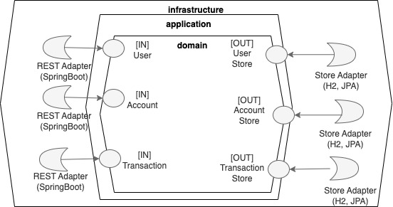

# Table of Contents

1. [Introduction](#introduction)
2. [Requirements](#requirements)
3. [How to Compile and Deploy](#How-to-Compile-and-Deploy)
4. [Using the REST API](#Using-the-REST-API)
5. [Architecture](#Architecture)


## Introduction

This project implements REST API with the limited functionalities of a Bank.
You can create *Users*, *Accounts* an execute *Transactions* of money between 2 Accounts.

The project is packaged as an auto-executable *Jar* but it can be deployed and run in
isolation in a *Docker* container as explained below.

## Requirements

The project has been compiled with the following version of Java:

```
$ java --version
java 17.0.4 2022-07-19 LTS
Java(TM) SE Runtime Environment (build 17.0.4+11-LTS-179)
Java HotSpot(TM) 64-Bit Server VM (build 17.0.4+11-LTS-179, mixed mode, sharing)

```
Other Software needed to compile, deploy and run:

```
- git
- Docker
- curl
```

## How to Compile and Deploy

Clone the Repository:
```
git clone https://github.com/ilozanof/ioBuilders-bank.git
```
open a *Terminal* in the Project root and Compile & Run the tests:

```
gradle wrapper
```

```
./gradlew build
```

The execution should finish with a `BUILD SUCCESSFUL` statement.

Deploy the Project in a Docker image (this might take a few minutes)
```
./gradlew -b application/build.gradle bootBuildImage --imageName=iobuilders/bank
```
The Docker image should be now visible. You can check it if you run:

```
$ docker image ls
...
REPOSITORY                               TAG              IMAGE ID       CREATED         SIZE
iobuilders/bank                          latest           e0ce3cfd105f   43 years ago    315MB
```

Now we can run the App in a Container:
```
docker run -p  8080:8080 -d iobuilders/bank
```
The Project includes an *OpenAPI* online Documentation which can be accessed using a browser in this url:
```
http://localhost:8080/swagger-ui/index.html

```
## Using the REST API

> NOTE:
> All the REST Endpoints returns a rich response containing the Http Status code and HATEOAS Links
> The use fo HATEOAS comes with some impact in performance. It is OK in this *POC* but in a *Production* it should be considered carefully.

Create a User for *Alice* and *Bob*:
```
curl -X POST http://localhost:8080/v1/users -H 'Content-Type: application/json' -d '{"dni":"Alice-DNI", "name": "Alice"}'
```
```
curl -X POST http://localhost:8080/v1/users -H 'Content-Type: application/json' -d '{"dni":"Bob-DNI", "name": "Bob"}'
```
Create one Account for each one:
```
curl -X POST http://localhost:8080/v1/accounts -H 'Content-Type: application/json' -d "Alice-DNI"
```
```
curl -X POST http://localhost:8080/v1/accounts -H 'Content-Type: application/json' -d "Bob-DNI"
```

Now we are funding both account with some fictional balance with 2 transfers from some out-of-the-blue external Accounts:

> NOTE: As it will explained in the *Architecture* Chapter, a *deposit* is considered like a regular Transaction, but the
> *Origin Transaction* if from an *EXTERNAL* Account.
```
curl -X POST http://localhost:8080/v1/transactions -H 'Content-Type: application/json' -d '{"originAccountId":"EXTERNAL-xxx", "destinationAccountId": "IBAN-xxxx-xxxx-xxx-1", "amount": 1000, "date": "2024-01-01"}'
```
```
curl -X POST http://localhost:8080/v1/transactions -H 'Content-Type: application/json' -d '{"originAccountId":"EXTERNAL-xxx", "destinationAccountId": "IBAN-xxxx-xxxx-xxx-2", "amount": 1000, "date": "2024-01-01"}'
```

Now we can start moving Money around.

We send 100 coins from *Alice* to *Bob*.
```
curl -X POST http://localhost:8080/v1/transactions -H 'Content-Type: application/json' -d '{"originAccountId":"IBAN-xxxx-xxxx-xxx-1", "destinationAccountId": "IBAN-xxxx-xxxx-xxx-2", "amount": 100, "date": "2024-01-01"}'
```
We send another 50 coins from *Alice* to *Bob*
```
curl -X POST http://localhost:8080/v1/transactions -H 'Content-Type: application/json' -d '{"originAccountId":"IBAN-xxxx-xxxx-xxx-1", "destinationAccountId": "IBAN-xxxx-xxxx-xxx-2", "amount": 50, "date": "2024-01-01"}'
```
Now We send 120 coins from *Bob* to *alice*
```
curl -X POST http://localhost:8080/v1/transactions -H 'Content-Type: application/json' -d '{"originAccountId":"IBAN-xxxx-xxxx-xxx-2", "destinationAccountId": "IBAN-xxxx-xxxx-xxx-1", "amount": 120, "date": "2024-01-01"}'
```

We can check both Balances:

```
curl "http://localhost:8080/v1/accounts/IBAN-xxxx-xxxx-xxx-1"
...
{
  "owner" : "[Alice-DNI] Alice",
  "accountId" : "IBAN-xxxx-xxxx-xxx-1",
  "balance" : 970.0,
  "_links" : {
    "user" : {
      "href" : "http://localhost:8080/v1/users/Alice-DNI"
    },
    "self" : {
      "href" : "http://localhost:8080/v1/accounts/IBAN-xxxx-xxxx-xxx-1"
    },
    "transactions" : {
      "href" : "http://localhost:8080/v1/transactions?accountId=IBAN-xxxx-xxxx-xxx-1&page=0"
    }
  }
}
```

```
curl "http://localhost:8080/v1/accounts/IBAN-xxxx-xxxx-xxx-2"
...
{
  "owner" : "[Bob-DNI] Bob",
  "accountId" : "IBAN-xxxx-xxxx-xxx-2",
  "balance" : 1030.0,
  "_links" : {
    "user" : {
      "href" : "http://localhost:8080/v1/users/Bob-DNI"
    },
    "self" : {
      "href" : "http://localhost:8080/v1/accounts/IBAN-xxxx-xxxx-xxx-2"
    },
    "transactions" : {
      "href" : "http://localhost:8080/v1/transactions?accountId=IBAN-xxxx-xxxx-xxx-2&page=0"
    }
  }
}
```


If you try to move more money than the Origin Account's balance, you get an error:
```
curl -X POST http://localhost:8080/v1/transactions -H 'Content-Type: application/json' -d '{"originAccountId":"IBAN-xxxx-xxxx-xxx-2", "destinationAccountId": "IBAN-xxxx-xxxx-xxx-1", "amount": 50000, "date": "2024-01-01"}'
...
{
  "status" : "BAD_REQUEST",
  "message" : "NOT ENOUGH BALANCE",
  "errors" : [ "" ]
}
```

Similar errors are returned when the Account or User doesn't exist, etc.

## Architecture
This chapter describes the overall architecture and design decisions.

### Domain Driven Design

Following the *DDD* Pattern, we define the following *Bounded Contexts*:

1. *Users*
2. *Accounts*
3. *Transactions*

All of them have enough importance to be treated as a separate entity, but they obviously have relationships with each other.
The *Ubiquitous Language* define for this project will help clarify concepts and will work as a *bridge* between the *business*
and the *Technical Part*: We have defined the following concepts:

- **User**: It represents a Physical person in the real word. A User that registers in the Bank becomes a *Client* of the
  bank. One single User can open multiple *Accounts* in the Bank.
- **Account**: It represents a Placeholder that contains a *Balance* and a *list* of *Transactions*. The *Balance* represents the
  sum of all the *transactions* executed on that *Account*. An *Account* MUST belong ONLY to ONE *User*. An *Account* might have any
  *balance* as long is it is equal or greater than ZERO(0).
- **Transfer**: A *Transfer* is the movement of Money from one *Account* (origin) to another (destination). A *Transaction* can be done
  between 2 *Accounts* of this Bank, but one of the 2 *Account* (origin or destination) might belong to an *External* Bank.
- **Internal Account**: An Account registered in this Bank.
- **External Account**: An Account NOT registered in this Bank. External Accounts are not controlled by this API and we can NOT
  affect the Balance of this external Accounts, but an *Account Check* is performed.
- **Account Check**: A verification process that indicates if an *Account* can take part in a *Transaction*. An account is considered *Valid* if
  it full fills one of 2 checks: a) it belongs to *This* bank, or b) it does **not** belong to this bank, but its *ID* complies with the 
  *External Account Id Rule*
- **External Account Id Rule**: A rule that specifies that the *Id* of an *External Account* MUST starts with "*EXTERNAL-*".

### Hexagonal Architecture

The project is broken down into different components following a hexagonal architecture:




The project contains 3 modules: *domain*, *infrastructure* and *application*, and each one is divided further
down following the *bounded context* defined (*User*, *Account*, *Transaction*).

The *Domain* modules defines several ports:

- *[IN]*: A *Primary* port that exposes the Bank Functionality. This port will be used by the *consuming* apps/systems of this Bank.
- *[OUT]*: A *Secondary* port that defines *Storage capabilities*, needed by the Bank business logic.

> NOTE: The Ports, same as with the *domain* model itself, have been broken down following the bounded contexts defined.
> **It might have also been a good ide ot integrate all the [IN] ports into a unified Port, and the same for
> the [OUT] ports**.


### Implementation Details

#### Java9 Modules
The project uses *Java9* **Modules** to make a more robust distinction between all the components above.
This allows us to define exactly what is it *visible* between different Modules

#### Transaction Security and Concurrency

**Transaction** is the most important concept in a Bank. At any given time, multiple Transactions are executed, and we must ensure the consistency in the
balances of all Accounts involved. So we need to make sure that Transactions are executed in an ACID fashion and concurrent
Transaction involving the same Account do NOT interfiere with each Other.

To achieve this, we have developed a LOCK mechanism at 2 levels:

- In the Business Logic Level, we define a Lock system that LOCKS an Account if that Account is being used in
  a Transaction. Multiple Transaction can be executed in parallel, as long as they affect different Transactions. This
  prevents some errors to happen, but it only works inside the same *Java Virtual Machine*. So for account for more security,  
  another level of security has been developed (below):

- In the Storage Layer, we implemented a *PESSIMISTIC LOCK* at DB level, so the *Row* of a Transaction is Locked when a
  Transaction starts running, and it remains Locked until the Transaction is finished, so the data of that dow can not be read or Write during
  that time.

#### Other Security Considerations
During Testing, it very frequent that we need to *remove* or *clean* the data between tests. So there is usually a 
"*clean()*", "*removeAll()*" or similar method in our Services. This is ok as long as the development team is aware that 
those methods SHOULD NOT be used in Production code, ever.

If we want to make this more strict, we can **remove** those methods from the */main* module and add them *ONLY* to the 
*/test* module. This is also ok since those methods can never be run in Production, since a lot of security checks must 
be followed nd we'll *never* remove the whole set of *Users/Account/Transaction", but selectively instead. In this projects, 
these "*dangerous*" methods have been added to specific classes used only for Testing: *AccountStoreForTesting*, *TransactionStoreForTesting* 
and *UserStoreForTesting*.


> NOTE:
> The Lock at Business-level is implemented in *TransactionServiceImpl* and *AccountLockManager*.


#### Other Security Considerations
During Testing, it very frequent that we need to *remove* or *clean* the data between tests. So there is usually a 
"*clean()*", "*removeAll()*" or similar method in our Services. This is ok as long as the development team is aware that 
those methods SHOULD NOT be used in Production code, ever.

If we want to make this more strict, we can **remove** those methods from the */main* module and add them *ONLY* to the 
*/test* module. This is also ok since those methods can never be run in Production, since a lot of security checks must 
be followed nd we'll *never* remove the whole set of *Users/Account/Transaction", but selectively instead. In this projects, 
these "*dangerous*" methods have been added to specific classes used only for Testing: *AccountStoreForTesting*, *TransactionStoreForTesting* 
and *UserStoreForTesting*.
